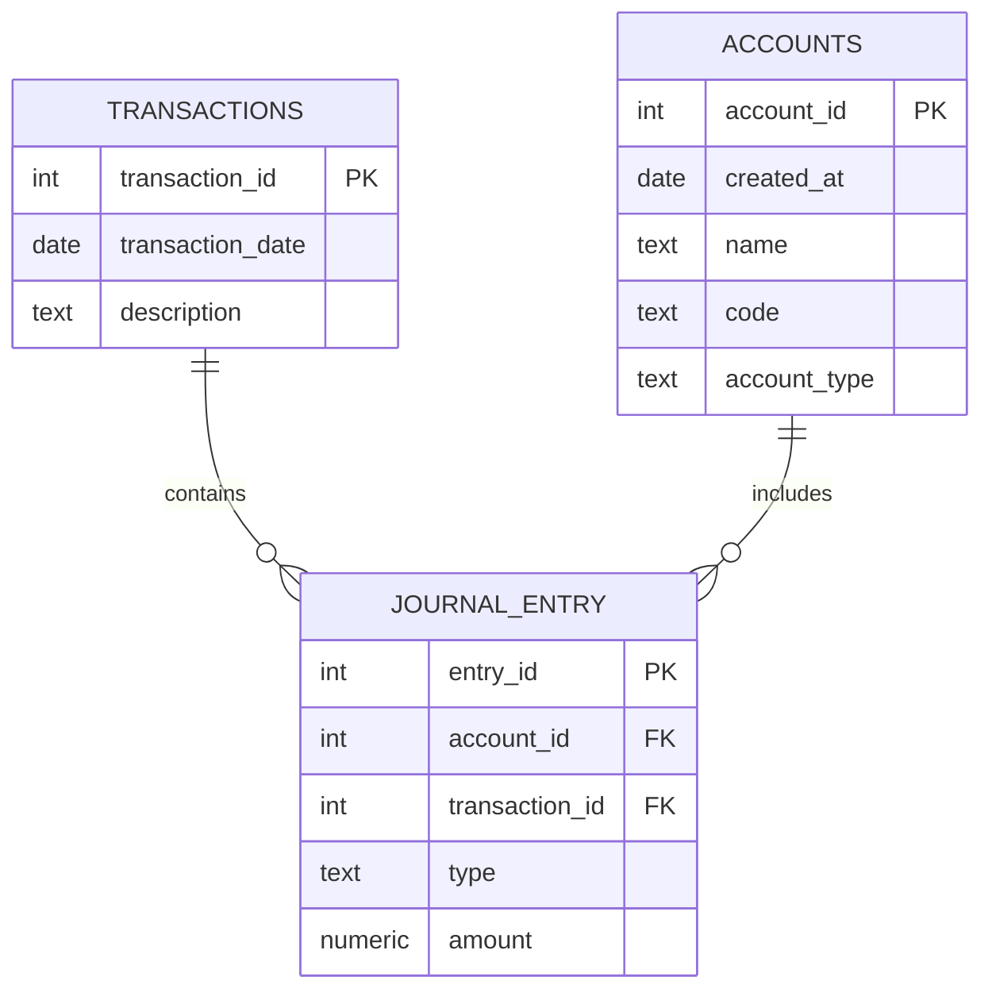

```mermaid
erDiagram
    TRANSACTIONS ||--o{ JOURNAL_ENTRY : contains
    ACCOUNTS ||--o{ JOURNAL_ENTRY : includes    
    JOURNAL_ENTRY {
        int entry_id PK
        int account_id FK
        int transaction_id FK
        text type
        numeric amount
    }
    TRANSACTIONS {
        int transaction_id PK
        date transaction_date
        text description
        

    }
    ACCOUNTS {
        int account_id PK
        date created_at
        text name
        text code
        text account_type

    }
```