# Mermaid Diagram Cheat Sheet

---

## 1. Flowchart

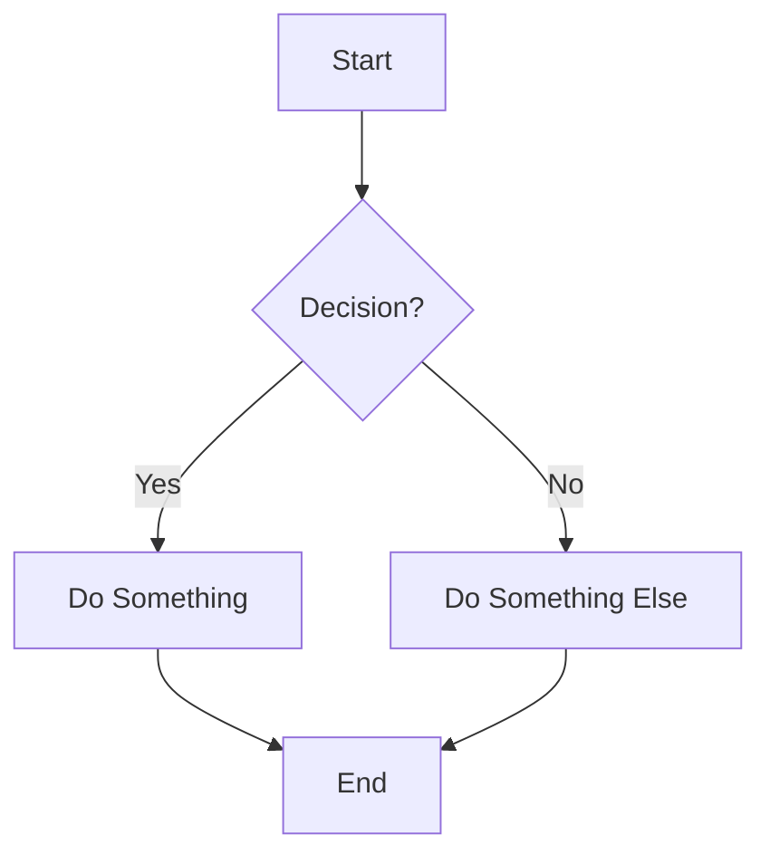

**Syntax Tips:**
- `flowchart TD` — top-down; use `LR` for left-right, `BT` for bottom-top, `RL` for right-left
- `[Text]` — rectangle, `(Text)` — rounded, `{Text}` — diamond, `((Text))` — circle
- `-->` — arrow, `---` — line, `-- label -->` — labeled arrow

---

## 2. Sequence Diagram

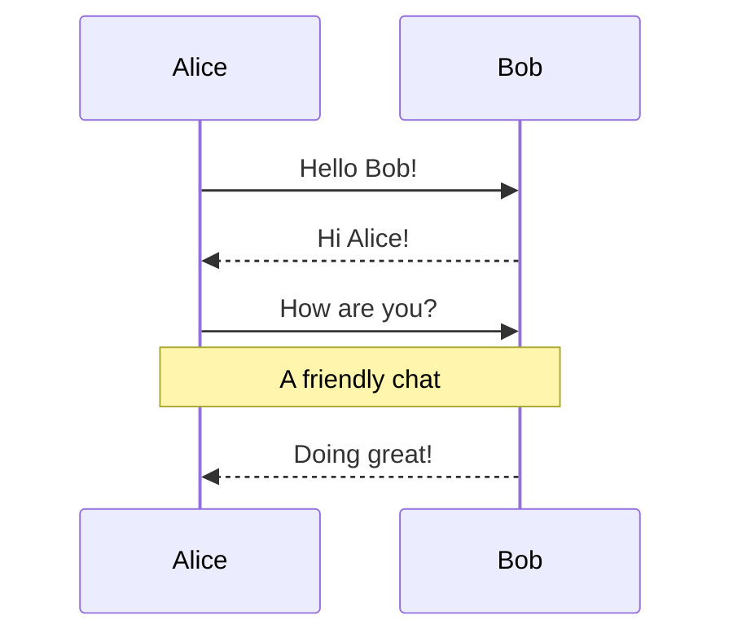

**Syntax Tips:**
- `->>` — solid arrow, `-->>` — dashed arrow
- `->` — solid line (no arrowhead), `-->` — dashed line
- `Note over A,B:` — note spanning participants
- `activate` / `deactivate` — show activation bars

---

## 3. Class Diagram

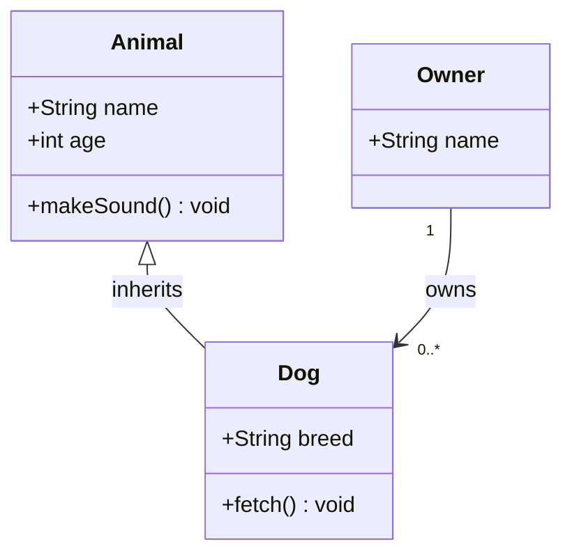

**Syntax Tips:**
- `<|--` inheritance, `*--` composition, `o--` aggregation, `-->` association
- `+` public, `-` private, `#` protected
- `<<interface>>` or `<<abstract>>` for stereotypes

---

## 4. Entity Relationship Diagram

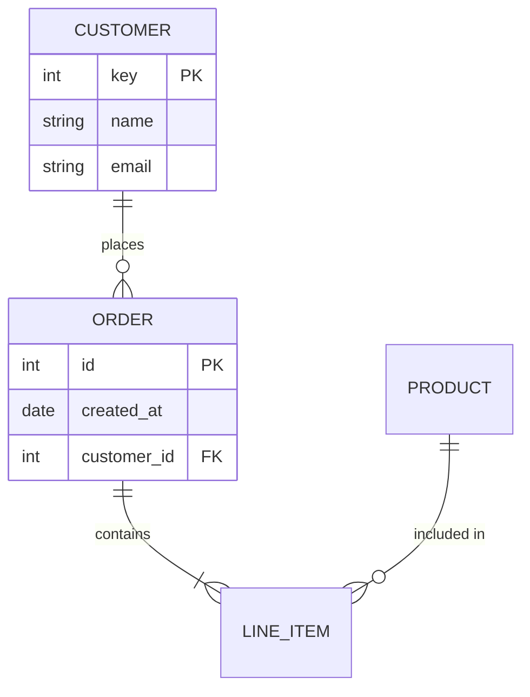

**Syntax Tips:**
- `||--o{` — one to zero-or-many, `||--|{` — one to one-or-many, `}o--o{` — many to many
- Attribute syntax: `type name PK/FK`

---

## 5. State Diagram

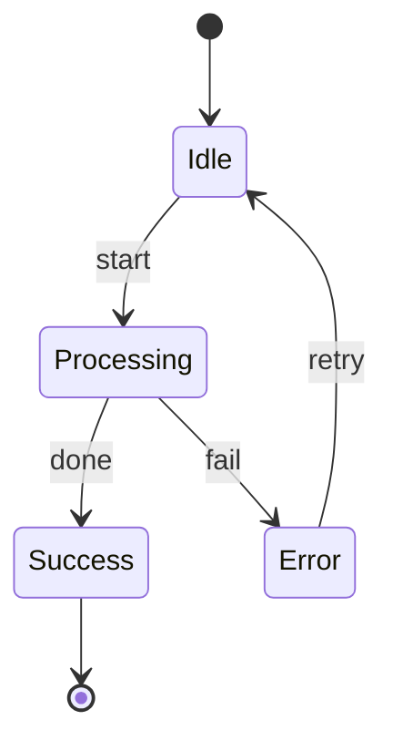

**Syntax Tips:**
- `[*]` — start/end state
- `StateA --> StateB : event` — transition with label
- `state "Description" as alias` — named states
- Use `state X { ... }` for composite/nested states

---

## 6. Gantt Chart

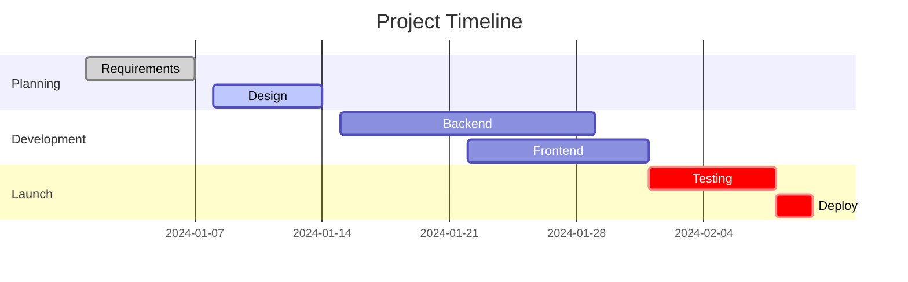

**Syntax Tips:**
- `dateFormat` sets the input date format
- `done`, `active`, `crit` are task modifiers
- `after taskId` — sets dependency
- Duration: `7d`, `2w`, or explicit end date

---

## 7. Pie Chart

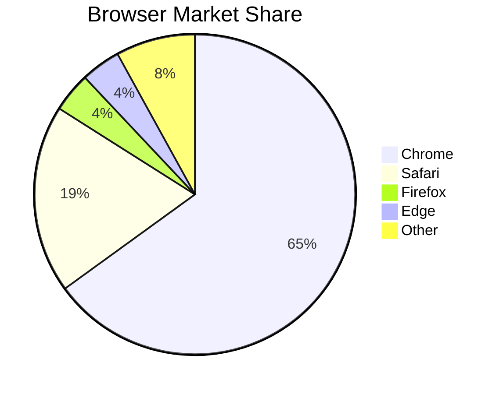

**Syntax Tips:**
- `title` is optional
- Values are relative (don't need to sum to 100)

---

## 8. Git Graph

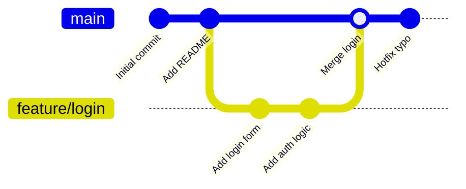

**Syntax Tips:**
- `branch name` — create branch
- `checkout name` — switch branch
- `merge name` — merge into current branch
- `commit id: "label"` — named commit

---

## 9. Mindmap

```mermaid
mindmap
  root((Mermaid))
    Diagrams
      Flowchart
      Sequence
      Class
    Charts
      Gantt
      Pie
    Other
      Git Graph
      Mindmap
      Timeline
```

**Syntax Tips:**
- Indentation defines the tree hierarchy
- `((text))` — circle root, `[text]` — box, `(text)` — rounded, `{{text}}` — hexagon

---

## 10. Timeline

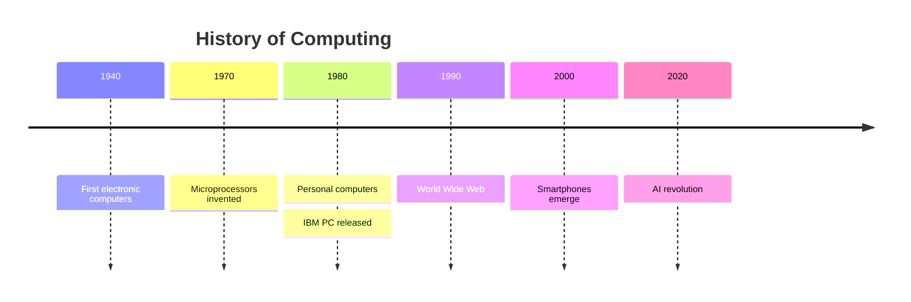

**Syntax Tips:**
- Year or label on the left, events on the right with `:`
- Multiple events per time point — just add more `: event` lines

---

## Quick Reference: Common Shapes (Flowchart)

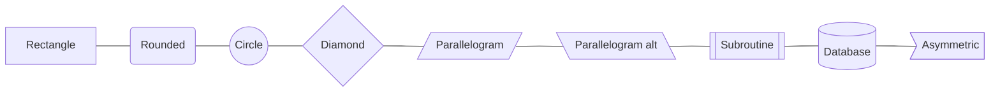

---

## Quick Reference: Link Styles (Flowchart)

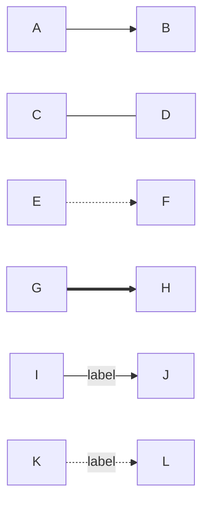

| Syntax       | Meaning                  |
|--------------|--------------------------|
| `-->`        | Arrow                    |
| `---`        | Line (no arrow)          |
| `-.->` / `-.->`| Dotted arrow          |
| `==>`        | Thick arrow              |
| `--text-->`  | Labeled arrow            |
| `o--o`       | Circle ends              |
| `<-->`       | Bidirectional            |
